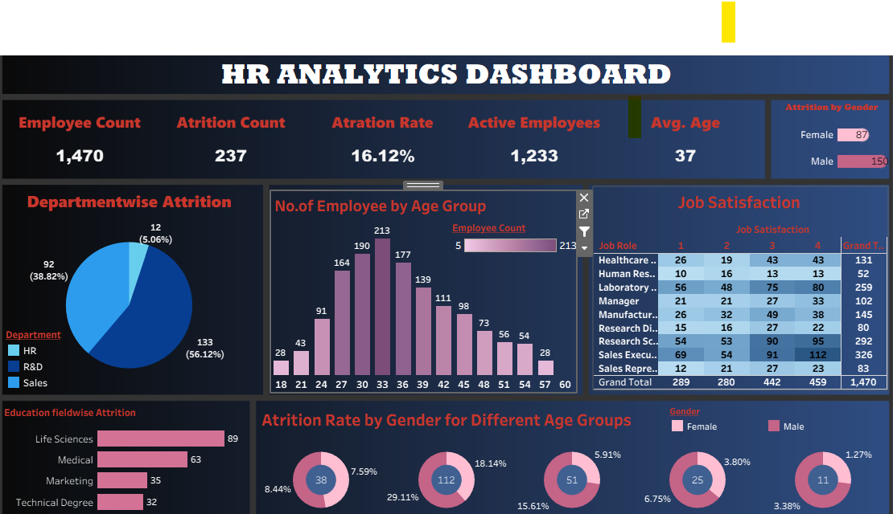

# HR Analytics Dashboard | Employee Attrition Analysis

> An interactive Tableau dashboard designed to analyze workforce trends, employee attrition, and key HR metrics to support data-driven decision-making.

---

## 📌 Project Overview

Employee attrition is one of the most significant challenges faced by organizations. Understanding why employees leave helps HR teams improve retention strategies, reduce hiring costs, and build a more productive workforce.

This project uses **Tableau** to transform raw HR data into an interactive dashboard that enables users to explore employee demographics, attrition patterns, salary distribution, job satisfaction, and workforce performance through dynamic visualizations.

---

## 🎯 Business Problem

Organizations often struggle to identify the underlying reasons behind employee turnover.

This dashboard helps answer questions such as:

- Which departments experience the highest attrition?
- Which age group is most likely to leave?
- Does salary influence employee attrition?
- Which job roles have the highest turnover?
- How does education affect attrition?
- How satisfied are employees across different roles?

---

## 🎯 Project Objectives

- Analyze employee attrition across different dimensions.
- Monitor important HR KPIs.
- Identify patterns affecting employee retention.
- Build an interactive dashboard for HR decision-makers.
- Present insights through effective visual storytelling.

---

## 🛠 Tools & Technologies

| Tool | Purpose |
|------|----------|
| Tableau | Dashboard Development & Visualization |
| Microsoft Excel | Data Source |
| Data Analytics | Data Interpretation |
| Business Intelligence | Reporting & Decision Support |

---

## 📂 Dataset

The dataset contains employee information including:

- Employee ID
- Age
- Gender
- Department
- Job Role
- Education
- Education Field
- Marital Status
- Monthly Income
- Business Travel
- Job Satisfaction
- Work-Life Balance
- Performance Rating
- Years at Company
- Years Since Last Promotion
- Overtime
- Attrition Status

---

# 📈 Dashboard Overview

The dashboard consists of multiple interactive visualizations designed to provide a comprehensive view of workforce analytics.

### Key Performance Indicators (KPIs)

- 👥 Total Employees
- 🚪 Total Attrition
- 📉 Attrition Rate
- 💰 Average Monthly Income
- 🎂 Average Employee Age
- 📅 Average Years at Company

---

### Dashboard Visualizations

- Department-wise Attrition
- Job Role-wise Attrition
- Employee Distribution by Age
- Attrition by Education Field
- Attrition by Gender
- Attrition by Salary Slab
- Job Satisfaction Analysis
- Years at Company Analysis
- Interactive Filters & Slicers

---

# 📊 Key Insights

✔ Sales department recorded the highest employee attrition.

✔ Employees aged **26–35 years** experienced the highest turnover.

✔ Lower salary brackets showed a higher likelihood of employee attrition.

✔ Laboratory Technicians and Sales Executives had the highest attrition among job roles.

✔ Employees with fewer years at the company were more likely to leave.

✔ Life Sciences and Medical graduates represented a significant share of attrition.

---

# 📷 Dashboard Preview

> Replace the image below with your dashboard screenshot.

#  How to Run the Project

1. Open the `.twbx` file using Tableau Desktop or Tableau Public.

3. Explore the dashboard using interactive filters.

---

# 💼 Skills Demonstrated

- Data Cleaning
- Data Visualization
- Dashboard Design
- KPI Development
- Business Intelligence
- HR Analytics
- Data Storytelling
- Analytical Thinking
- Tableau Dashboard Development

---

# 📚 What I Learned

During this project, I gained practical experience in:

- Designing professional Tableau dashboards
- Building business-oriented KPIs
- Creating interactive filters and actions
- Converting raw HR data into actionable insights
- Applying data storytelling techniques
- Presenting analytical findings effectively

---

# 🔮 Future Enhancements

- Employee Attrition Prediction using Machine Learning
- Real-time Database Connectivity
- Department-Level Drill-down Reports
- Recruitment Analytics Dashboard
- Employee Performance Dashboard
- Automated Dashboard Refresh

---

# 👨‍💻 About Me

**Narendra Pittala**

Aspiring Data Analyst passionate about transforming data into actionable business insights through visualization and analytics.

### Technical Skills

- SQL
- Excel
- Tableau
- Power BI
- Python
- Git & GitHub

---

## ⭐ Support

If you found this project helpful or interesting, consider giving it a ⭐ on GitHub. Your support motivates me to build more data analytics projects.

---

## 📄 License

This project is intended for educational purposes and portfolio demonstration.
